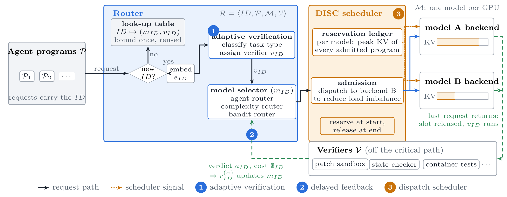

<h1 align="center">ORACLE</h1>

<h3 align="center">Concurrency-aware routing and scheduling for agentic LLM programs.</h3>

<p align="center">
| <a href="docs/README.md"><b>Docs</b></a> | <a href="examples/"><b>Examples</b></a> | <a href="https://arxiv.org/pdf/2607.22465"><b>Paper</b></a> |
</p>

---

## About

ORACLE sits between agent clients and your inference backends. It decides, once per agentic
task (a *program*: many LLM requests that share a prefix), which model runs it and when it is
admitted to that model's GPU, then learns from what the task's own verifier says afterwards.

Two pieces, use either or both:

| Piece | What it does | Use alone |
|---|---|---|
| **Router** (`oracle.routing`, `oracle.verification`) | Binds each program to a model with a pluggable *selector*: LinUCB bandit (default), ACRouter, RouteLLM, a fixed model, or your own. Picks a type-matched verifier per program from a few example requests, runs it off the critical path, and learns from the delayed verdict. | `Router(...)` |
| **DISC** (`oracle.scheduling`) | Dispatch scheduler: a KV-cache *reservation ledger* and admission gate per backend, plus a rule that moves a program to a less loaded backend only when the shorter wait is worth the accuracy. Pure Python, no serving-stack dependency. | `DISC(...)` |

`Oracle` wires router and DISC together, and `oracle serve` exposes the result as an
OpenAI-compatible proxy with a live dashboard. Clients change one thing: they send a `program_id`.

<p align="center"></p>

## Getting started

```bash
git clone https://github.com/ORACLE-org/ORACLE.git
cd ORACLE
pip install -e ".[server]"
```

Serve two models (one per GPU) behind ORACLE:

```bash
vllm serve Qwen/Qwen3.6-27B-FP8 --port 8001
vllm serve Qwen/Qwen3.5-9B     --port 8002

oracle serve --models qwen27b=http://localhost:8001/v1 qwen9b=http://localhost:8002/v1 --port 8300
# dashboard: http://localhost:8300/ui
```

Point your agent at port 8300 and add a program id:

```python
client = openai.OpenAI(base_url="http://localhost:8300/v1", api_key="EMPTY")

client.chat.completions.create(model="auto", messages=messages,
                               extra_body={"program_id": task_id})          # first request binds the program
...
client.chat.completions.create(model="auto", messages=messages,
                               extra_body={"program_id": task_id, "program_done": True,
                                           "program_success": 1.0})          # last request releases it
```

If your harness grades tasks itself, pass `program_success`; otherwise configure verifiers
(a test command, an HTTP service, a Python function, an LLM judge) and ORACLE scores the
program after it finishes. The outcome can also be posted later:
`POST /programs/{id}/complete {"success": 1.0, "cost": 0.12, "payload": {...}}`.

No GPUs at hand? `oracle demo` runs a synthetic workload through every selector.

## Pick the pieces you need

**Routing only** (hosted APIs, no KV cache to manage):

```python
from oracle import Router, ProgramOutcome, PrototypeVerifierSelector

router = Router(["strong", "weak"], selector="linucb",
                verifiers={"swe": run_tests, "tau2": check_state},
                verifier_selector=PrototypeVerifierSelector({"swe": swe_examples, "tau2": tau2_examples}))

b = router.bind("task-17", prompt=first_user_message)      # b.model, b.verifier
...                                                       # run the agent on b.model
router.complete("task-17", ProgramOutcome("task-17", cost=0.12, payload={...}))   # verify + learn, async
```

Or `oracle serve --no-scheduler`, or `scheduler: {enabled: false}` in the config.

**Scheduling only** (keep your router, add admission control):

```python
from oracle import DISC

disc = DISC({"gpu-a": VLLMCapacity("http://localhost:8001/v1"), "gpu-b": 120_000})
backend, _ = disc.dispatch("gpu-a", estimates=None)   # proposal in, backend out (no estimates = no diversion)
await disc.admit("task-17", backend)                   # blocks until the ledger has room
...
disc.release("task-17", peak_tokens=31_000)           # frees the reservation, learns the peak
```

Or `oracle serve --router none`, or drop DISC into an existing stack:
[ThunderAgent](docs/integrations.md#thunderagent) (`install(ta_router, disc)`),
any OpenAI-compatible ASGI server such as SGLang or vLLM ([`DISCMiddleware`](docs/integrations.md#sglang--vllm--any-asgi-server)),
or a [LiteLLM](docs/integrations.md#litellm) router.

**Both**: `Oracle(router, disc)` or `oracle serve --config examples/configs/full.yaml`.

## Swap the router backend

```bash
oracle serve ... --selector linucb      # contextual bandit (default)
oracle serve ... --selector ucb         # UCB1 per task type
oracle serve ... --selector acrouter    # ACRouter: task memory + orchestrator LLM
oracle serve ... --selector routellm    # RouteLLM pre-trained router (pip install routellm)
oracle serve ... --selector fixed       # one model
```

Your own policy is a class with two methods (and an optional third that lets DISC price a diversion):

```python
from oracle import ModelSelector, register_selector

@register_selector("cheapest_first")
class CheapestFirst(ModelSelector):
    def select(self, ctx):                 # ctx.prompt, ctx.features, ctx.task_type, ctx.metadata
        return self.models[-1]
    def update(self, ctx, model, reward):  # delayed reward of a finished program
        pass
```

`selector: cheapest_first` in the config, or `make_selector("cheapest_first", models)`.
Packages can register selectors through the `oracle.selectors` entry point.

## Repository layout

```
oracle/
├── types.py            Binding (lookup-table row), RoutingContext, ProgramOutcome
├── core.py             Oracle: router + DISC
├── config.py           oracle.yaml <-> dataclasses, object builders
├── routing/            ModelSelector + registry; bandit, static, acrouter, routellm; features; reward; Router
├── verification/       the router's verifiers, embedders, verifier selection, FeedbackLoop
├── scheduling/         ReservationLedger, AdmissionGate, DispatchPolicy, DISC, capacity sources (vLLM/SGLang)
├── server/             FastAPI proxy, SSE pass-through, dashboard (ui/index.html)
├── integrations/       thunderagent, fastapi middleware, litellm
└── sim.py              synthetic workload for demos and tests
examples/               runnable scripts + YAML configs
docs/                   architecture, routing, verification, scheduling, server API, integrations, configuration
tests/                  pytest (no GPUs, no network)
```

## Development

```bash
pip install -e ".[dev]"
pytest -q
oracle demo --programs 500
```

## Citation

If you use ORACLE, please cite the [paper](https://arxiv.org/pdf/2607.22465):

```bibtex
@misc{raj2026oracle,
  title         = {ORACLE: Agentic AI Orchestrator Routing Via Adaptive Verifier Calibration Feedback},
  author        = {Ritik Raj and Souvik Kundu and Dheemanth Joshi and Tushar Krishna},
  year          = {2026},
  eprint        = {2607.22465},
  archivePrefix = {arXiv},
  url           = {https://arxiv.org/abs/2607.22465}
}
```

## License

MIT. See [LICENSE](LICENSE).
