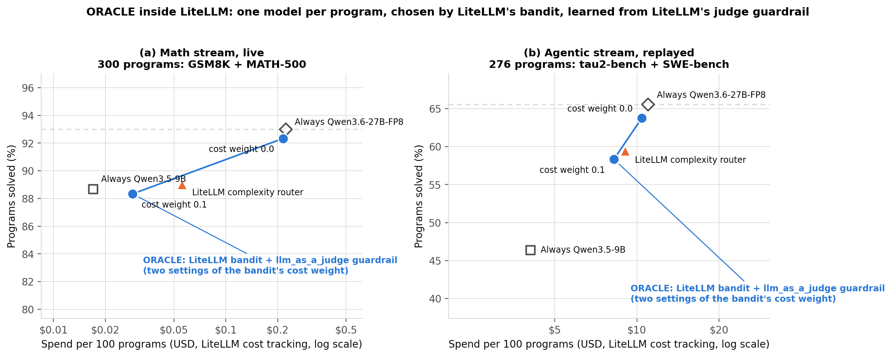

# Integrations

## ThunderAgent

The adapter wraps three methods of ThunderAgent's `MultiBackendRouter` so that every program
passes DISC's gate at its first request. ThunderAgent's code is untouched.

```python
from ThunderAgent.scheduler import MultiBackendRouter
from oracle.scheduling import DISC, VLLMCapacity
from oracle.integrations.thunderagent import install

ta = MultiBackendRouter(urls, backend_type="vllm")
disc = DISC({u: VLLMCapacity(u) for u in urls}, policy=None)        # admission only
install(ta, disc)                                                   # before app startup
```

* at a program's first request, `disc.dispatch` + `disc.admit` run before the host's own
  capacity check (the program may wait at the gate);
* after each request, `disc.update` records the context length;
* `release_program` frees the reservation.

Pass `propose=` (and `estimates=`) to let an ORACLE `Router` choose the backend and DISC apply the
dispatch rule. `examples/07_thunderagent_disc.py` is a complete launcher.

## SGLang / vLLM / any ASGI server

Put the gate in front of the engine without a separate proxy:

```python
from oracle.scheduling import DISC
from oracle.integrations.fastapi import DISCMiddleware

app.add_middleware(DISCMiddleware, disc=DISC({"local": 150_000}),
                   backend_of=lambda payload: "local")       # several backends: pick by payload
```

The middleware reads `program_id` (body, `extra_body`, or header), admits the program at its
first request, and releases it on `program_done: true` or `POST /programs/release`. For the
SGLang router or a vLLM server you do not run in-process, use `oracle serve --router none` in
front of it instead (same behaviour, plus the dashboard).

## LiteLLM

ORACLE's router is also proposed upstream as a LiteLLM strategy (`auto_router/oracle_router`): the
decision maker is LiteLLM's own adaptive-router bandit (or any LiteLLM strategy router through
`pre_routing`) and the verifier is any LiteLLM guardrail, such as `llm_as_a_judge`. On a live math
stream (GSM8K + MATH-500) and a replayed agentic stream (tau2-bench + SWE-bench) over
Qwen3.6-27B-FP8 and Qwen3.5-9B, the bandit's cost weight traces the accuracy/spend frontier between
the two models, with LiteLLM's judge as the only feedback:




```python
from oracle.integrations.litellm import OracleRoutingStrategy
lr = litellm.Router(model_list=[...])          # model_name must match ORACLE's model names
lr.set_custom_routing_strategy(OracleRoutingStrategy(router))
await lr.acompletion(model="auto", messages=msgs, metadata={"program_id": "task-1"})
router.complete("task-1", ProgramOutcome("task-1", success=1.0, cost=0.12))
```

## Hosted APIs (OpenAI, Anthropic-compatible gateways, ...)

Routing only: point each model at the provider's OpenAI-compatible base URL with its `served_name`,
`api_key` and prices, and disable the scheduler (`examples/configs/router_only.yaml`).

## Your own loop

No server at all: `Router.bind / complete` and `DISC.dispatch / admit / release` are plain
Python (see `examples/01`, `02`, `03`).
